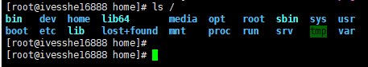
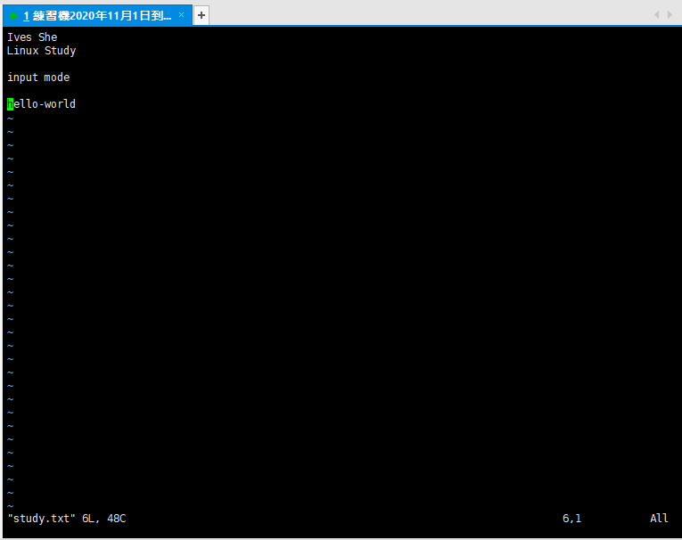

# Linux Study
學習之後，製作成筆記，方便日後使用時復習
- 

# 阿里雲購買ECS
購買完成需重新設置實例名稱及密碼，並重啟主機
- 

# 使用XShell連接
使用XShelL6 連接主機
輸入公網IP、帳號名稱root及剛剛重新修改過的密碼
主機IP 47.242.12.45
- 
- 

# 安全性群組規則
阿里雲ECS內建已開啟這3個port，XShell使用22端口
之後若有新的應用，需從這裡作新增及修改
- 

# 以開啟6379端口為例(Redis)
- 

# 寶塔面板(圖形化介面)
參考用，先不安裝
[寶塔面板](https://www.bt.cn/bbs/thread-19376-1-1.html)
示意圖
- 

# 使用XFTP 6傳輸主機的檔案
方便上傳文件，無需打指令
- 

# 虛擬機安裝CentOS7
## 方便本地測試
- 使用VM Ware Workstation 15.5.5.6 build-16341506
- 安裝CentOS7 - CentOS-7-x86_64-DVD-2003.iso [交大下載](http://centos.cs.nctu.edu.tw/7.8.2003/isos/x86_64/)

## 修改CentOS設定

```shell
vi /etc/sysconfig/network-scripts/ifcfg-ens33
```
```shell
TYPE=Ethernet
PROXY_METHOD=none
BROWSER_ONLY=no
BOOTPROTO=static
DEFROUTE=yes
IPV4_FAILURE_FATAL=no
IPV6INIT=yes
IPV6_AUTOCONF=yes
IPV6_DEFROUTE=yes
IPV6_FAILURE_FATAL=no
IPV6_ADDR_GEN_MODE=stable-privacy
NAME=ens33
UUID=預設即可
DEVICE=ens33
ONBOOT=yes
IPADDR=192.168.160.128
GATEWAY=192.168.160.2
NETMASK=255.255.255.0
DNS1=114.114.114.114
```


修改完成需重啟
```shell
service network restart
```

# 修改VM Ware設定


在上方選單 Edit -> Virtual Newwork Editor


## 連結成功


## 開啟防火牆


### 查看開放的端口號
```shell
firewall-cmd --list-all
```


### 設置開放的端口號
```shell
# xshell使用22端口連接
sudo firewall-cmd --add-port=22/tcp --permanent
```

### 重啟防火牆
```shell
firewall-cmd --reload
```
------

# 指令筆記
參考網路資料整理記錄，方便學習及之後使用時查詢

> 關機

在linux領域內大多用在服務器上，很少遇到關機的操作。畢竟服務器上跑一個服務是永無止境的，除非特殊情況下，不得已才會關機。

關機指令為：shutdown
```shell
sync # 將數據由內存同步到硬盤中。
shutdown # 關機指令，你可以man shutdown 來看一下幫助文檔。例如你可以運行如下命令關機：
shutdown –h 10 # 這個命令告訴大家，計算機將在10分鐘後關機
shutdown –h now # 立馬關機
shutdown –h 20:25 # 系統會在今天20:25關機
shutdown –h +10 # 十分鐘後關機
shutdown –r now # 系統立馬重啟
shutdown –r +10 # 系統十分鐘後重啟
reboot # 就是重啟，等同於 shutdown –r now
halt # 關閉系統，等同於shutdown –h now 和 poweroff
```

> 系統目錄結構

登錄系統後，在當前命令窗口下輸入命令：
```shell
ls /
```
- 

以下是對這些目錄的解釋：

- /bin：bin是Binary的縮寫, 這個目錄存放著最經常使用的命令。
- /boot： 這里存放的是啟動Linux時使用的一些核心文件，包括一些連接文件以及鏡像文件。
- /dev ： dev是Device(設備)的縮寫, 存放的是Linux的外部設備，在Linux中訪問設備的方式和訪問文件的方式是相同的。
- /etc： 這個目錄用來存放所有的系統管理所需要的配置文件和子目錄。
- /home：用戶的主目錄，在Linux中，每個用戶都有一個自己的目錄，一般該目錄名是以用戶的賬號命名的。
- /lib：這個目錄里存放著系統最基本的動態連接共享庫，其作用類似於Windows里的DLL文件。
- /lost+found：這個目錄一般情況下是空的，當系統非法關機後，這里就存放了一些文件。
- /media：linux系統會自動識別一些設備，例如U盤、光驅等等，當識別後，linux會把識別的設備掛載到這個目錄下。
- /mnt：系統提供該目錄是為了讓用戶臨時掛載別的文件系統的，我們可以將光驅掛載在/mnt/上，然後進入該目錄就可以查看光驅里的內容了。
- /opt：這是給主機額外安裝軟件所擺放的目錄。比如你安裝一個ORACLE數據庫則就可以放到這個目錄下。默認是空的。
- /proc：這個目錄是一個虛擬的目錄，它是系統內存的映射，我們可以通過直接訪問這個目錄來獲取系統信息。
- /root：該目錄為系統管理員，也稱作超級權限者的用戶主目錄。
- /sbin：s就是Super User的意思，這里存放的是系統管理員使用的系統管理程序。
- /srv：該目錄存放一些服務啟動之後需要提取的數據。
- /sys：這是linux2.6內核的一個很大的變化。該目錄下安裝了2.6內核中新出現的一個文件系統 sysfs 。
- /tmp：這個目錄是用來存放一些臨時文件的。
- /usr：這是一個非常重要的目錄，用戶的很多應用程序和文件都放在這個目錄下，類似於windows下的program files目錄。
- /usr/bin： 系統用戶使用的應用程序。
- /usr/sbin： 超級用戶使用的比較高級的管理程序和系統守護程序。
- /usr/src： 內核源代碼默認的放置目錄。
- /var：這個目錄中存放著在不斷擴充著的東西，我們習慣將那些經常被修改的目錄放在這個目錄下。包括各種日志文件。
- /run：是一個臨時文件系統，存儲系統啟動以來的信息。當系統重啟時，這個目錄下的文件應該被刪掉或清除。

# 常用的基本命令
## 目錄管理

> 處理目錄的常用命令

- ls: 列出目錄
- cd：切換目錄 ```cd ~ # 可回root目錄```
- pwd：顯示目前的目錄
- mkdir：創建一個新的目錄
- rmdir：刪除一個空的目錄
- cp: 覆制文件或目錄
- rm: 移除文件或目錄
- mv: 移動文件與目錄，或修改文件與目錄的名稱
- 可以使用 man [命令] 來查看各個命令的使用文檔，如 ：man cp。

> ls （列出目錄）

-a ：全部的文件，連同隱藏文件( 開頭為 . 的文件) 一起列出來(常用)
-l ：長數據串列出，包含文件的屬性與權限等等數據；(常用)

```shell
 ls -al # 將目錄下的所有文件列出來(含屬性與隱藏檔)
```

> pwd ( 顯示目前所在的目錄 )

pwd 是 Print Working Directory 的縮寫，也就是顯示目前所在目錄的命令。
```shell
pwd -P # 選項與參數：-P ：顯示出確實的路徑，而非使用連接(link) 路徑。
```

> mkdir （創建新目錄）

如果想要創建新的目錄的話，那麽就使用mkdir (make directory)吧。

mkdir [-mp] 目錄名稱
選項與參數：

-m ：配置文件的權限喔！直接配置，不需要看默認權限 (umask) 的臉色
-p ：幫助你直接將所需要的目錄(包含上一級目錄)遞歸創建起來！

> rmdir ( 刪除空的目錄 )

語法：
rmdir [-p] 目錄名稱
選項與參數：-p ：連同上一級『空的』目錄也一起刪除

> cp ( 复制文件或目录 )

語法：
```shell
cp [-adfilprsu] 來源檔(source) 目標檔(destination)
cp [options] source1 source2 source3 .... directory
```
選項與參數：

-a：相當於 -pdr 的意思，至於 pdr 請參考下列說明；(常用)
-p：連同文件的屬性一起覆制過去，而非使用默認屬性(備份常用)；
-d：若來源檔為連結檔的屬性(link file)，則覆制連結檔屬性而非文件本身；
-r：遞歸持續覆制，用於目錄的覆制行為；(常用)
-f：為強制(force)的意思，若目標文件已經存在且無法開啟，則移除後再嘗試一次；
-i：若目標檔(destination)已經存在時，在覆蓋時會先詢問動作的進行(常用)
-l：進行硬式連結(hard link)的連結檔創建，而非覆制文件本身。
-s：覆制成為符號連結檔 (symbolic link)，亦即『捷徑』文件；
-u：若 destination 比 source 舊才升級 destination ！

> rm ( 移除文件或目錄 )

語法：
rm [-fir] 文件或目錄
選項與參數：

-f ：就是 force 的意思，忽略不存在的文件，不會出現警告信息；
-i ：互動模式，在刪除前會詢問使用者是否動作
-r ：遞歸刪除啊！最常用在目錄的刪除了！這是非常危險的選項！！！

盡量不要在服務器上使用 rm -rf /

> mv  ( 移動文件與目錄，或修改名稱 )

語法：
mv [-fiu] source destination
mv [options] source1 source2 source3 .... directory

選項與參數：
-f ：force 強制的意思，如果目標文件已經存在，不會詢問而直接覆蓋；
-i ：若目標文件 (destination) 已經存在時，就會詢問是否覆蓋！
-u ：若目標文件已經存在，且 source 比較新，才會升級 (update)

> 看懂文件屬性

Linux系統是一種典型的多用戶系統，不同的用戶處於不同的地位，擁有不同的權限。為了保護系統的安全性，Linux系統對不同的用戶訪問同一文件（包括目錄文件）的權限做了不同的規定。

在Linux中我們可以使用ll或者ls –l命令來顯示一個文件的屬性以及文件所屬的用戶和組，如：實例中，boot文件的第一個屬性用"d"表示。"d"在Linux中代表該文件是一個目錄文件。

在Linux中第一個字符代表這個文件是目錄、文件或鏈接文件等等：

當為[ d ]則是目錄
當為[ - ]則是文件；
若是[ l ]則表示為鏈接文檔 ( link file )；
若是[ b ]則表示為裝置文件里面的可供儲存的接口設備 ( 可隨機存取裝置 )；
若是[ c ]則表示為裝置文件里面的串行端口設備，例如鍵盤、鼠標 ( 一次性讀取裝置 )。
接下來的字符中，以三個為一組，且均為『rwx』 的三個參數的組合。
其中，[ r ]代表可讀(read)、[ w ]代表可寫(write)、[ x ]代表可執行(execute)。
要注意的是，這三個權限的位置不會改變，如果沒有權限，就會出現減號[ - ]而已。
每個文件的屬性由左邊第一部分的10個字符來確定（如下圖）：

從左至右用0-9這些數字來表示。

第0位確定文件類型，第1-3位確定屬主（該文件的所有者）擁有該文件的權限。第4-6位確定屬組（所有者的同組用戶）擁有該文件的權限，第7-9位確定其他用戶擁有該文件的權限。

對於文件來說，它都有一個特定的所有者，也就是對該文件具有所有權的用戶。同時，在Linux系統中，用戶是按組分類的，一個用戶屬於一個或多個組。文件所有者以外的用戶又可以分為文件所有者的同組用戶和其他用戶。因此，Linux系統按文件所有者、文件所有者同組用戶和其他用戶來規定了不同的文件訪問權限。

- 
- 

> 修改文件屬性

1、chgrp：更改文件屬組

chgrp [-R] 屬組名 文件名
-R：遞歸更改文件屬組，就是在更改某個目錄文件的屬組時，如果加上-R的參數，那麽該目錄下的所有文件的屬組都會更改。

- 

2、chown：更改文件屬主，也可以同時更改文件屬組

chown [–R] 屬主名 文件名
chown [-R] 屬主名：屬組名 文件名

3、chmod：更改文件9個屬性

chmod [-R] xyz 文件或目錄
Linux文件屬性有兩種設置方法，一種是數字，一種是符號。

Linux文件的基本權限就有九個，分別是owner/group/others三種身份各有自己的read/write/execute權限。

先覆習一下剛剛上面提到的數據：文件的權限字符為：『-rwxrwxrwx』， 這九個權限是三個三個一組的！其中，我們可以使用數字來代表各個權限，各權限的分數對照表如下：

- r:4     w:2         x:1
每種身份(owner/group/others)各自的三個權限(r/w/x)分數是需要累加的，例如當權限為：[-rwxrwx---] 分數則是：
owner = rwx = 4+2+1 = 7
group = rwx = 4+2+1 = 7
others= --- = 0+0+0 = 0
```shell
chmod 770 filename
```
- 

## 文件內容查看

概述

Linux系統中使用以下命令來查看文件的內容：
- cat 由第一行開始顯示文件內容
- tac 從最後一行開始顯示，可以看出 tac 是 cat 的倒著寫！
- nl  顯示的時候，順道輸出行號！
- more 一頁一頁的顯示文件內容
- less 與 more 類似，但是比 more 更好的是，他可以往前翻頁！
- head 只看頭幾行
- tail 只看尾巴幾行

可以使用 man [命令]來查看各個命令的使用文檔，如 ：man cp。

==網路配置目錄(CentOS7)： cd /etc/sysconfig/network-scripts==
==ifconfig命令可以查看網路配置==

> cat 由第一行開始顯示文件內容

語法：

cat [-AbEnTv]
選項與參數：
-A ：相當於 -vET 的整合選項，可列出一些特殊字符而不是空白而已；
-b ：列出行號，僅針對非空白行做行號顯示，空白行不標行號！
-E ：將結尾的斷行字節 $ 顯示出來；
-n ：列印出行號，連同空白行也會有行號，與 -b 的選項不同；
-T ：將 [tab] 按鍵以 ^I 顯示出來；
-v ：列出一些看不出來的特殊字符

tac與cat命令剛好相反，文件內容從最後一行開始顯示，可以看出 tac 是 cat 的倒著寫！如：

> nl  顯示行號

語法：

nl [-bnw] 文件
選項與參數：

-b ：指定行號指定的方式，主要有兩種：-b a ：表示不論是否為空行，也同樣列出行號(類似 cat -n)；-b t ：如果有空行，空的那一行不要列出行號(默認值)；
-n ：列出行號表示的方法，主要有三種：-n ln ：行號在熒幕的最左方顯示；-n rn ：行號在自己欄位的最右方顯示，且不加 0 ；-n rz ：行號在自己欄位的最右方顯示，且加 0 ；
-w ：行號欄位的占用的位數。

> more  一頁一頁翻動

在 more 這個程序的運行過程中，你有幾個按鍵可以按的：
空白鍵 (space)：代表向下翻一頁；
Enter     ：代表向下翻『一行』；
/字串     ：代表在這個顯示的內容當中，向下搜尋『字串』這個關鍵字；
:f      ：立刻顯示出檔名以及目前顯示的行數；
q       ：代表立刻離開 more ，不再顯示該文件內容。
b 或 [ctrl]-b ：代表往回翻頁，不過這動作只對文件有用，對管線無用。

> less   一頁一頁翻動

less運行時可以輸入的命令有：

空白鍵  ：向下翻動一頁；
[pagedown]：向下翻動一頁；
[pageup] ：向上翻動一頁；
/字串   ：向下搜尋『字串』的功能；
?字串   ：向上搜尋『字串』的功能；
n     ：重覆前一個搜尋 (與 / 或 ? 有關！)
N     ：反向的重覆前一個搜尋 (與 / 或 ? 有關！)
q     ：離開 less 這個程序；

> head  取出文件前面幾行

語法：
head [-n number] 文件
選項與參數：-n 後面接數字，代表顯示幾行的意思！
默認的情況中，顯示前面 10 行！若要顯示前 20 行，就得要這樣：
```shell
head -n 20 /etc/csh.login
```

> tail  取出文件後面幾行

語法：

tail [-n number] 文件
選項與參數：

-n ：後面接數字，代表顯示幾行的意思
默認的情況中，顯示最後 10 行！若要顯示最後 20 行，就得要這樣：
```shell
tail -n 20 /etc/csh.login
```

> 拓展：Linux 鏈接概念

Linux 鏈接分兩種，一種被稱為硬鏈接（Hard Link），另一種被稱為符號鏈接（Symbolic Link）。

情況下，ln 命令產生硬鏈接。

硬連接

硬連接指通過索引節點來進行連接。在 Linux 的文件系統中，保存在磁盤分區中的文件不管是什麽類型都給它分配一個編號，稱為索引節點號(Inode Index)。在 Linux 中，多個文件名指向同一索引節點是存在的。比如：A 是 B 的硬鏈接（A 和 B 都是文件名），則 A 的目錄項中的 inode 節點號與 B 的目錄項中的 inode 節點號相同，即一個 inode 節點對應兩個不同的文件名，兩個文件名指向同一個文件，A 和 B 對文件系統來說是完全平等的。刪除其中任何一個都不會影響另外一個的訪問。

硬連接的作用是允許一個文件擁有多個有效路徑名，這樣用戶就可以建立硬連接到重要文件，以防止“誤刪”的功能。其原因如上所述，因為對應該目錄的索引節點有一個以上的連接。只刪除一個連接並不影響索引節點本身和其它的連接，只有當最後一個連接被刪除後，文件的數據塊及目錄的連接才會被釋放。也就是說，文件真正刪除的條件是與之相關的所有硬連接文件均被刪除。

軟連接

另外一種連接稱之為符號連接（Symbolic Link），也叫軟連接。軟鏈接文件有類似於 Windows 的快捷方式。它實際上是一個特殊的文件。在符號連接中，文件實際上是一個文本文件，其中包含的有另一文件的位置信息。比如：A 是 B 的軟鏈接（A 和 B 都是文件名），A 的目錄項中的 inode 節點號與 B 的目錄項中的 inode 節點號不相同，A 和 B 指向的是兩個不同的 inode，繼而指向兩塊不同的數據塊。但是 A 的數據塊中存放的只是 B 的路徑名（可以根據這個找到 B 的目錄項）。A 和 B 之間是“主從”關系，如果 B 被刪除了，A 仍然存在（因為兩個是不同的文件），但指向的是一個無效的鏈接。

測試：
```shell
cd /home
touch f1 # 創建一個測試文件f1
ls
f1
ln f1 f2     # 創建f1的一個硬連接文件f2
ln -s f1 f3   # 創建f1的一個符號連接文件f3
ls -li       # -i參數顯示文件的inode節點信息
# 397247 -rw-r--r-- 2 root root     0 Mar 13 00:50 f1
# 397247 -rw-r--r-- 2 root root     0 Mar 13 00:50 f2
# 397248 lrwxrwxrwx 1 root root     2 Mar 13 00:50 f3 -> f1
```
從上面的結果中可以看出，硬連接文件 f2 與原文件 f1 的 inode 節點相同，均為 397247，然而符號連接文件的 inode 節點不同。

```shell
# echo 字符串輸出 >> f1 輸出到 f1文件
echo "I am f1 file" >>f1
cat f1
I am f1 file
cat f2
I am f1 file
cat f3
I am f1 file
rm -f f1
cat f2
I am f1 file
cat f3
cat: f3: No such file or directory
```
- 

通過上面的測試可以看出：當刪除原始文件 f1 後，硬連接 f2 不受影響，但是符號連接 f1 文件無效；

依此您可以做一些相關的測試，可以得到以下全部結論：
刪除符號連接f3,對f1,f2無影響；
刪除硬連接f2，對f1,f3也無影響；
刪除原文件f1，對硬連接f2沒有影響，導致符號連接f3失效；
同時刪除原文件f1,硬連接f2，整個文件會真正的被刪除。

------

# Vim編輯器

> 什麼是Vim編輯器

Vim是從 vi 发展出來的一個文本編輯器。代碼補完、編譯及錯誤跳轉等方便編程的功能特別豐富，在程序員中被廣泛使用。
簡單的來說， vi 是老式的字處理器，不過功能已經很齊全了，但是還是有可以進步的地方。
vim 則可以說是程序開发者的一項很好用的工具。
所有的 Unix Like 系統都會內建 vi 文書編輯器，其他的文書編輯器則不一定會存在。
連 vim 的官方網站 (http://www.vim.org) 自己也說 vim 是一個程序開发工具而不是文字處理軟件。

> 三種使用模式

基本上 vi/vim 共分為三種模式，分別是命令模式（Command mode），輸入模式（Insert mode）和底線命令模式（Last line mode）。這三種模式的作用分別是：

命令模式：

用戶剛剛啟動 vi/vim，便進入了命令模式。
此狀態下敲擊鍵盤動作會被Vim識別為命令，而非輸入字符。比如我們此時按下i，並不會輸入一個字符，i被當作了一個命令。

以下是常用的幾個命令：

- i 切換到輸入模式，以輸入字符。
- x 刪除當前光標所在處的字符。
- : 切換到底線命令模式，以在最底一行輸入命令。

- 

若想要編輯文本：啟動Vim，進入了命令模式，按下i，切換到輸入模式。
命令模式只有一些最基本的命令，因此仍要依靠底線命令模式輸入更多命令。

輸入模式：
在命令模式下按下i就進入了輸入模式。
在輸入模式中，可以使用以下按鍵：
字符按鍵以及Shift組合，輸入字符

- ENTER，回車鍵，換行
- BACK SPACE，退格鍵，刪除光標前一個字符
- DEL，刪除鍵，刪除光標後一個字符
- 方向鍵，在文本中移動光標
- HOME/END，移動光標到行首/行尾
- Page Up/Page Down，上/下翻頁
- Insert，切換光標為輸入/替換模式，光標將變成豎線/下劃線
- ESC，退出輸入模式，切換到命令模式

> 底線命令模式

在命令模式下按下:（英文冒號）就進入了底線命令模式。
底線命令模式可以輸入單個或多個字符的命令，可用的命令非常多。
在底線命令模式中，基本的命令有（已經省略了冒號）：
- q 退出程序
- w 保存文件
- 按ESC鍵可隨時退出底線命令模式。

- 

按下 i 進入輸入模式(也稱為編輯模式)，開始編輯文字
在一般模式之中，只要按下 i, o, a 等字符就可以進入輸入模式了！

在編輯模式當中，你可以发現在左下角狀態欄中會出現 –INSERT- 的字樣，那就是可以輸入任意字符的提示。

這個時候，鍵盤上除了 Esc 這個按鍵之外，其他的按鍵都可以視作為一般的輸入按鈕了，所以你可以進行任何的編輯。

按下 ESC 按鈕回到一般模式
在一般模式中按下 :wq 儲存後離開 vim！

> Vim 按鍵說明

除了上面簡易範例的 i, Esc, :wq 之外，其實 vim 還有非常多的按鍵可以使用。

- 
- 
- 
- 
- 

設置行號(打code常用)
- 

------ 
# 賬號管理

 > 簡介

Linux系統是一個多用戶多任務的分時操作系統，任何一個要使用系統資源的用戶，都必須首先向系統管理員申請一個賬號，然後以這個賬號的身份進入系統。

用戶的賬號一方面可以幫助系統管理員對使用系統的用戶進行跟蹤，並控制他們對系統資源的訪問；另一方面也可以幫助用戶組織文件，並為用戶提供安全性保護。

每個用戶賬號都擁有一個唯一的用戶名和各自的口令。
用戶在登錄時鍵入正確的用戶名和口令後，就能夠進入系統和自己的主目錄。

實現用戶賬號的管理，要完成的工作主要有如下幾個方面：

- 用戶賬號的添加、刪除與修改。
- 用戶口令的管理。
- 用戶組的管理。

> 用戶賬號的管理

用戶賬號的管理工作主要涉及到用戶賬號的添加、修改和刪除。

添加用戶賬號就是在系統中創建一個新賬號，然後為新賬號分配用戶號、用戶組、主目錄和登錄Shell等資源。

> 添加賬號 useradd

useradd 選項 用戶名


參數說明：
-c comment 指定一段注釋性描述。
-d 目錄 指定用戶主目錄，如果此目錄不存在，則同時使用-m選項，可以創建主目錄。
-g 用戶組 指定用戶所屬的用戶組。
-G 用戶組，用戶組 指定用戶所屬的附加組。
-m　使用者目錄如不存在則自動建立。
-s Shell文件 指定用戶的登錄Shell。
-u 用戶號 指定用戶的用戶號，如果同時有-o選項，則可以重覆使用其他用戶的標識號。

用戶名 :
指定新賬號的登錄名。
- 此命令創建了一個用戶kuangshen，其中-m選項用來為登錄名ivesshe產生一個主目錄 /home/ivesshe
- 
增加用戶賬號就是在/etc/passwd文件中為新用戶增加一條記錄，同時更新其他系統文件如/etc/shadow, /etc/group等。

> Linux下如何切換用戶

1.切換用戶的命令為：su username 【username是你的用戶名哦】
2.從普通用戶切換到root用戶，還可以使用命令：sudo su
3.在終端輸入exit或logout或使用快捷方式ctrl+d，可以退回到原來用戶，其實ctrl+d也是執行的exit命令
4.在切換用戶時，如果想在切換用戶之後使用新用戶的工作環境，可以在su和username之間加-，例如：【su - root】

==$表示普通用戶==
==#表示超級用戶，也就是root用戶==
- 

> 刪除帳號

如果一個用戶的賬號不再使用，可以從系統中刪除。
刪除用戶賬號就是要將/etc/passwd等系統文件中的該用戶記錄刪除，必要時還刪除用戶的主目錄。
刪除一個已有的用戶賬號使用userdel命令，其格式如下：

userdel 選項 用戶名
常用的選項是 -r，它的作用是把用戶的主目錄一起刪除。
```shell
userdel -r ivesshe
```
此命令刪除用戶kuangshen在系統文件中（主要是/etc/passwd, /etc/shadow, /etc/group等）的記錄，同時刪除用戶的主目錄。

> 修改帳號

修改用戶賬號就是根據實際情況更改用戶的有關屬性，如用戶號、主目錄、用戶組、登錄Shell等。

修改已有用戶的信息使用usermod命令，其格式如下：

```shell
usermod 選項 用戶名
```
常用的選項包括-c, -d, -m, -g, -G, -s, -u以及-o等，這些選項的意義與useradd命令中的選項一樣，可以為用戶指定新的資源值。

例如：

```shell
usermod -s /bin/ives -d /home/z –g developer ivesshe
```
此命令將用戶ivesshe的登錄Shell修改為ives，主目錄改為/home/z，用戶組改為developer。
 
> 用戶口令(密碼)的管理

用戶管理的一項重要內容是用戶口令的管理。用戶賬號剛創建時沒有口令，但是被系統鎖定，無法使用，必須為其指定口令後才可以使用，即使是指定空口令。

指定和修改用戶口令的Shell命令是passwd。超級用戶可以為自己和其他用戶指定口令，普通用戶只能用它修改自己的口令。

命令的格式為：
```shell
passwd 選項 用戶名
```
可使用的選項：

-l 鎖定口令，即禁用賬號。
-u 口令解鎖。
-d 使賬號無口令。
-f 強迫用戶下次登錄時修改口令。

如果默認用戶名，則修改當前用戶的口令。

例如，假設當前用戶是ivesshe，則下面的命令修改該用戶自己的口令：
```shell
passwd
Old password:******
New password:*******
Re-enter new password:*******
```
如果是超級用戶，可以用下列形式指定任何用戶的口令：

設定好密碼，再開一新分頁，使用新帳號ivesshe作連結
- 

```shell
passwd ivesshe
New password:*******
Re-enter new password:*******
```
普通用戶修改自己的口令時，passwd命令會先詢問原口令，驗證後再要求用戶輸入兩遍新口令，如果兩次輸入的口令一致，則將這個口令指定給用戶；而超級用戶為用戶指定口令時，就不需要知道原口令。

> 鎖定帳戶

passwd 命令還可以用 -l(lock) 選項鎖定某一用戶，使其不能登錄，例如：
```shell
passwd -l ivesshe
```
為用戶指定空口令時，執行下列形式的命令：

```shell
passwd -d ivesshe 
```
此命令將用戶 ivesshe的口令刪除，這樣用戶 ivesshe下一次登錄時，系統就不再允許該用戶登錄了。

# 筆記到p12
------

> 用戶組管理

每個用戶都有一個用戶組，系統可以對一個用戶組中的所有用戶進行集中管理。不同Linux 系統對用戶組的規定有所不同，如Linux下的用戶屬於與它同名的用戶組，這個用戶組在創建用戶時同時創建。

用戶組的管理涉及用戶組的添加、刪除和修改。組的增加、刪除和修改實際上就是對/etc/group文件的更新。

增加一個新的用戶組使用groupadd命令

groupadd 選項 用戶組
可以使用的選項有：

-g GID 指定新用戶組的組標識號（GID）。

-o 一般與-g選項同時使用，表示新用戶組的GID可以與系統已有用戶組的GID相同。

實例1：

# groupadd group1
此命令向系統中增加了一個新組group1，新組的組標識號是在當前已有的最大組標識號的基礎上加1。

實例2：

# groupadd -g 101 group2
此命令向系統中增加了一個新組group2，同時指定新組的組標識號是101。


如果要刪除一個已有的用戶組，使用groupdel命令

groupdel 用戶組
例如：

# groupdel group1
此命令從系統中刪除組group1。


修改用戶組的屬性使用groupmod命令

groupmod 選項 用戶組
常用的選項有：

-g GID 為用戶組指定新的組標識號。

-o 與-g選項同時使用，用戶組的新GID可以與系統已有用戶組的GID相同。

-n新用戶組 將用戶組的名字改為新名字

# 此命令將組group2的組標識號修改為102。
groupmod -g 102 group2

# 將組group2的標識號改為10000，組名修改為group3。
groupmod –g 10000 -n group3 group2


切換組

如果一個用戶同時屬於多個用戶組，那麼用戶可以在用戶組之間切換，以便具有其他用戶組的權限。

用戶可以在登錄後，使用命令newgrp切換到其他用戶組，這個命令的參數就是目的用戶組。例如：

$ newgrp root
這條命令將當前用戶切換到root用戶組，前提條件是root用戶組確實是該用戶的主組或附加組。


/etc/passwd

完成用戶管理的工作有許多種方法，但是每一種方法實際上都是對有關的系統文件進行修改。

與用戶和用戶組相關的信息都存放在一些系統文件中，這些文件包括/etc/passwd, /etc/shadow, /etc/group等。

下面分別介紹這些文件的內容。

/etc/passwd文件是用戶管理工作涉及的最重要的一個文件。

Linux系統中的每個用戶都在/etc/passwd文件中有一個對應的記錄行，它記錄了這個用戶的一些基本屬性。

這個文件對所有用戶都是可讀的。它的內容類似下面的例子：

＃ cat /etc/passwd

root:x:0:0:Superuser:/:
daemon:x:1:1:System daemons:/etc:
bin:x:2:2:Owner of system commands:/bin:
sys:x:3:3:Owner of system files:/usr/sys:
adm:x:4:4:System accounting:/usr/adm:
uucp:x:5:5:UUCP administrator:/usr/lib/uucp:
auth:x:7:21:Authentication administrator:/tcb/files/auth:
cron:x:9:16:Cron daemon:/usr/spool/cron:
listen:x:37:4:Network daemon:/usr/net/nls:
lp:x:71:18:Printer administrator:/usr/spool/lp:
從上面的例子我們可以看到，/etc/passwd中一行記錄對應著一個用戶，每行記錄又被冒號(:)分隔為7個字段，其格式和具體含義如下：

用戶名:口令:用戶標識號:組標識號:注釋性描述:主目錄:登錄Shell
1）"用戶名"是代表用戶賬號的字符串。

通常長度不超過8個字符，並且由大小寫字母和/或數字組成。登錄名中不能有冒號(:)，因為冒號在這里是分隔符。

為了兼容起見，登錄名中最好不要包含點字符(.)，並且不使用連字符(-)和加號(+)打頭。

2）“口令”一些系統中，存放著加密後的用戶口令字。

雖然這個字段存放的只是用戶口令的加密串，不是明文，但是由於/etc/passwd文件對所有用戶都可讀，所以這仍是一個安全隱患。因此，現在許多Linux 系統（如SVR4）都使用了shadow技術，把真正的加密後的用戶口令字存放到/etc/shadow文件中，而在/etc/passwd文件的口令字段中只存放一個特殊的字符，例如“x”或者“*”。

3）“用戶標識號”是一個整數，系統內部用它來標識用戶。

一般情況下它與用戶名是一一對應的。如果幾個用戶名對應的用戶標識號是一樣的，系統內部將把它們視為同一個用戶，但是它們可以有不同的口令、不同的主目錄以及不同的登錄Shell等。

通常用戶標識號的取值範圍是0～65 535。0是超級用戶root的標識號，1～99由系統保留，作為管理賬號，普通用戶的標識號從100開始。在Linux系統中，這個界限是500。

4）“組標識號”字段記錄的是用戶所屬的用戶組。

它對應著/etc/group文件中的一條記錄。

5)“注釋性描述”字段記錄著用戶的一些個人情況。

例如用戶的真實姓名、電話、地址等，這個字段並沒有什麼實際的用途。在不同的Linux 系統中，這個字段的格式並沒有統一。在許多Linux系統中，這個字段存放的是一段任意的注釋性描述文字，用作finger命令的輸出。

6)“主目錄”，也就是用戶的起始工作目錄。

它是用戶在登錄到系統之後所處的目錄。在大多數系統中，各用戶的主目錄都被組織在同一個特定的目錄下，而用戶主目錄的名稱就是該用戶的登錄名。各用戶對自己的主目錄有讀、寫、執行（搜索）權限，其他用戶對此目錄的訪問權限則根據具體情況設置。

7)用戶登錄後，要啟動一個進程，負責將用戶的操作傳給內核，這個進程是用戶登錄到系統後運行的命令解釋器或某個特定的程序，即Shell。

Shell是用戶與Linux系統之間的接口。Linux的Shell有許多種，每種都有不同的特點。常用的有sh(Bourne Shell), csh(C Shell), ksh(Korn Shell), tcsh(TENEX/TOPS-20 type C Shell), bash(Bourne Again Shell)等。

系統管理員可以根據系統情況和用戶習慣為用戶指定某個Shell。如果不指定Shell，那麼系統使用sh為默認的登錄Shell，即這個字段的值為/bin/sh。

用戶的登錄Shell也可以指定為某個特定的程序（此程序不是一個命令解釋器）。

利用這一特點，我們可以限制用戶只能運行指定的應用程序，在該應用程序運行結束後，用戶就自動退出了系統。有些Linux 系統要求只有那些在系統中登記了的程序才能出現在這個字段中。

8)系統中有一類用戶稱為偽用戶（pseudo users）。

這些用戶在/etc/passwd文件中也占有一條記錄，但是不能登錄，因為它們的登錄Shell為空。它們的存在主要是方便系統管理，滿足相應的系統進程對文件屬主的要求。

常見的偽用戶如下所示：

偽 用 戶 含 義
bin 擁有可執行的用戶命令文件
sys 擁有系統文件
adm 擁有帳戶文件
uucp UUCP使用
lp lp或lpd子系統使用
nobody NFS使用
/etc/shadow

1、除了上面列出的偽用戶外，還有許多標準的偽用戶，例如：audit, cron, mail, usenet等，它們也都各自為相關的進程和文件所需要。

由於/etc/passwd文件是所有用戶都可讀的，如果用戶的密碼太簡單或規律比較明顯的話，一台普通的計算機就能夠很容易地將它破解，因此對安全性要求較高的Linux系統都把加密後的口令字分離出來，單獨存放在一個文件中，這個文件是/etc/shadow文件。有超級用戶才擁有該文件讀權限，這就保證了用戶密碼的安全性。

2、/etc/shadow中的記錄行與/etc/passwd中的一一對應，它由pwconv命令根據/etc/passwd中的數據自動產生

它的文件格式與/etc/passwd類似，由若幹個字段組成，字段之間用":"隔開。這些字段是：

登錄名:加密口令:最後一次修改時間:最小時間間隔:最大時間間隔:警告時間:不活動時間:失效時間:標志
"登錄名"是與/etc/passwd文件中的登錄名相一致的用戶賬號

"口令"字段存放的是加密後的用戶口令字，長度為13個字符。如果為空，則對應用戶沒有口令，登錄時不需要口令；如果含有不屬於集合 { ./0-9A-Za-z }中的字符，則對應的用戶不能登錄。

"最後一次修改時間"表示的是從某個時刻起，到用戶最後一次修改口令時的天數。時間起點對不同的系統可能不一樣。例如在SCO Linux 中，這個時間起點是1970年1月1日。

"最小時間間隔"指的是兩次修改口令之間所需的最小天數。

"最大時間間隔"指的是口令保持有效的最大天數。

"警告時間"字段表示的是從系統開始警告用戶到用戶密碼正式失效之間的天數。

"不活動時間"表示的是用戶沒有登錄活動但賬號仍能保持有效的最大天數。

"失效時間"字段給出的是一個絕對的天數，如果使用了這個字段，那麼就給出相應賬號的生存期。期滿後，該賬號就不再是一個合法的賬號，也就不能再用來登錄了。

/etc/group

用戶組的所有信息都存放在/etc/group文件中。

將用戶分組是Linux 系統中對用戶進行管理及控制訪問權限的一種手段。

每個用戶都屬於某個用戶組；一個組中可以有多個用戶，一個用戶也可以屬於不同的組。

當一個用戶同時是多個組中的成員時，在/etc/passwd文件中記錄的是用戶所屬的主組，也就是登錄時所屬的默認組，而其他組稱為附加組。

用戶要訪問屬於附加組的文件時，必須首先使用newgrp命令使自己成為所要訪問的組中的成員。

用戶組的所有信息都存放在/etc/group文件中。此文件的格式也類似於/etc/passwd文件，由冒號(:)隔開若幹個字段，這些字段有：

組名:口令:組標識號:組內用戶列表
"組名"是用戶組的名稱，由字母或數字構成。與/etc/passwd中的登錄名一樣，組名不應重覆。

"口令"字段存放的是用戶組加密後的口令字。一般Linux 系統的用戶組都沒有口令，即這個字段一般為空，或者是*。

"組標識號"與用戶標識號類似，也是一個整數，被系統內部用來標識組。

"組內用戶列表"是屬於這個組的所有用戶的列表/b]，不同用戶之間用逗號(,)分隔。這個用戶組可能是用戶的主組，也可能是附加組。


磁盤管理
概述

Linux磁盤管理好壞直接關系到整個系統的性能問題。

Linux磁盤管理常用命令為 df、du。

df ：列出文件系統的整體磁盤使用量

du：檢查磁盤空間使用量


df

df命令參數功能：檢查文件系統的磁盤空間占用情況。可以利用該命令來獲取硬盤被占用了多少空間，目前還剩下多少空間等信息。

語法：

df [-ahikHTm] [目錄或文件名]
選項與參數：

-a ：列出所有的文件系統，包括系統特有的 /proc 等文件系統；

-k ：以 KBytes 的容量顯示各文件系統；

-m ：以 MBytes 的容量顯示各文件系統；

-h ：以人們較易閱讀的 GBytes, MBytes, KBytes 等格式自行顯示；

-H ：以 M=1000K 取代 M=1024K 的進位方式；

-T ：顯示文件系統類型, 連同該 partition 的 filesystem 名稱 (例如 ext3) 也列出；

-i ：不用硬盤容量，而以 inode 的數量來顯示

測試：

# 將系統內所有的文件系統列出來！
# 在 Linux 底下如果 df 沒有加任何選項
# 那麼默認會將系統內所有的 (不含特殊內存內的文件系統與 swap) 都以 1 Kbytes 的容量來列出來！
[root@kuangshen /]# df
Filesystem     1K-blocks   Used Available Use% Mounted on
devtmpfs          889100       0    889100   0% /dev
tmpfs             899460     704    898756   1% /dev/shm
tmpfs             899460     496    898964   1% /run
tmpfs             899460       0    899460   0% /sys/fs/cgroup
/dev/vda1       41152812 6586736  32662368  17% /
tmpfs             179896       0    179896   0% /run/user/0
# 將容量結果以易讀的容量格式顯示出來
[root@kuangshen /]# df -h
Filesystem     Size Used Avail Use% Mounted on
devtmpfs       869M     0 869M   0% /dev
tmpfs           879M 708K 878M   1% /dev/shm
tmpfs           879M 496K 878M   1% /run
tmpfs           879M     0 879M   0% /sys/fs/cgroup
/dev/vda1       40G  6.3G   32G  17% /
tmpfs           176M     0 176M   0% /run/user/0
# 將系統內的所有特殊文件格式及名稱都列出來
[root@kuangshen /]# df -aT
Filesystem     Type       1K-blocks   Used Available Use% Mounted on
sysfs         sysfs               0       0         0    - /sys
proc           proc                0       0         0    - /proc
devtmpfs       devtmpfs       889100       0    889100   0% /dev
securityfs     securityfs          0       0         0    - /sys/kernel/security
tmpfs         tmpfs          899460     708    898752   1% /dev/shm
devpts         devpts              0       0         0    - /dev/pts
tmpfs         tmpfs          899460     496    898964   1% /run
tmpfs         tmpfs          899460       0    899460   0% /sys/fs/cgroup
cgroup         cgroup              0       0         0    - /sys/fs/cgroup/systemd
pstore         pstore              0       0         0    - /sys/fs/pstore
cgroup         cgroup              0       0         0    - /sys/fs/cgroup/freezer
cgroup         cgroup              0       0         0    - /sys/fs/cgroup/cpuset
cgroup         cgroup              0       0         0    - /sys/fs/cgroup/hugetlb
cgroup         cgroup              0       0         0    - /sys/fs/cgroup/blkio
cgroup         cgroup              0       0         0    - /sys/fs/cgroup/net_cls,net_prio
cgroup         cgroup              0       0         0    - /sys/fs/cgroup/memory
cgroup         cgroup              0       0         0    - /sys/fs/cgroup/pids
cgroup         cgroup              0       0         0    - /sys/fs/cgroup/cpu,cpuacct
cgroup         cgroup              0       0         0    - /sys/fs/cgroup/devices
cgroup         cgroup              0       0         0    - /sys/fs/cgroup/perf_event
configfs       configfs            0       0         0    - /sys/kernel/config
/dev/vda1     ext4         41152812 6586748  32662356  17% /
systemd-1      -                   -       -         -    - /proc/sys/fs/binfmt_misc
mqueue         mqueue              0       0         0    - /dev/mqueue
debugfs       debugfs             0       0         0    - /sys/kernel/debug
hugetlbfs     hugetlbfs           0       0         0    - /dev/hugepages
tmpfs         tmpfs          179896       0    179896   0% /run/user/0
binfmt_misc   binfmt_misc         0       0         0    - /proc/sys/fs/binfmt_misc
# 將 /etc 底下的可用的磁盤容量以易讀的容量格式顯示

[root@kuangshen /]# df -h /etc
Filesystem     Size Used Avail Use% Mounted on
/dev/vda1       40G  6.3G   32G  17% /


du

Linux du命令也是查看使用空間的，但是與df命令不同的是Linux du命令是對文件和目錄磁盤使用的空間的查看，還是和df命令有一些區別的，這里介紹Linux du命令。

語法：

du [-ahskm] 文件或目錄名稱
選項與參數：

-a ：列出所有的文件與目錄容量，因為默認僅統計目錄底下的文件量而已。

-h ：以人們較易讀的容量格式 (G/M) 顯示；

-s ：列出總量而已，而不列出每個各別的目錄占用容量；

-S ：不包括子目錄下的總計，與 -s 有點差別。

-k ：以 KBytes 列出容量顯示；

-m ：以 MBytes 列出容量顯示；

測試：

# 只列出當前目錄下的所有文件夾容量（包括隱藏文件夾）:
# 直接輸入 du 沒有加任何選項時，則 du 會分析當前所在目錄的文件與目錄所占用的硬盤空間。
[root@kuangshen home]# du
16./redis
8./www/.oracle_jre_usage  # 包括隱藏文件的目錄
24./www
48.                        # 這個目錄(.)所占用的總量
# 將文件的容量也列出來
[root@kuangshen home]# du -a
4./redis/.bash_profile
4./redis/.bash_logout    
....中間省略....
4./kuangstudy.txt # 有文件的列表了
48.
# 檢查根目錄底下每個目錄所占用的容量
[root@kuangshen home]# du -sm /*
0/bin
146/boot
.....中間省略....
0/proc
.....中間省略....
1/tmp
3026/usr  # 系統初期最大就是他了啦！
513/var
2666/www
通配符 * 來代表每個目錄。

與 df 不一樣的是，du 這個命令其實會直接到文件系統內去搜尋所有的文件數據。


磁盤掛載與卸除

根文件系統之外的其他文件要想能夠被訪問，都必須通過“關聯”至根文件系統上的某個目錄來實現，此關聯操作即為“掛載”，此目錄即為“掛載點”,解除此關聯關系的過程稱之為“卸載”

Linux 的磁盤掛載使用mount命令，卸載使用umount命令。

磁盤掛載語法：

mount [-t 文件系統] [-L Label名] [-o 額外選項] [-n] 裝置文件名 掛載點
測試：

# 將 /dev/hdc6 掛載到 /mnt/hdc6 上面！
[root@www ~]# mkdir /mnt/hdc6
[root@www ~]# mount /dev/hdc6 /mnt/hdc6
[root@www ~]# df
Filesystem           1K-blocks     Used Available Use% Mounted on
/dev/hdc6              1976312     42072   1833836   3% /mnt/hdc6
磁盤卸載命令 umount 語法：

umount [-fn] 裝置文件名或掛載點
選項與參數：

-f ：強制卸除！可用在類似網絡文件系統 (NFS) 無法讀取到的情況下；

-n ：不升級 /etc/mtab 情況下卸除。

卸載/dev/hdc6

[root@www ~]# umount /dev/hdc6


後面的話，我們就開始搭建我們開发需要的服務器環境了！

視頻同步更新，這次一定！

# 查版本、核心

```bash
ls -l /etc/*-release

cat /etc/redhat-release

cat /etc/os-release
```


==學習資料來源: **狂神說** 及網路查詢==


